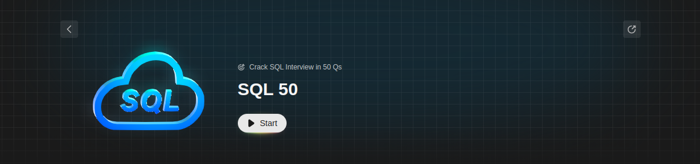

# Solutions for 50 SQL Leetcode question series

### The solutions listed here might not be the most optimal one and there may exist other approaches which are not included here. Contributions for the same are always appreciated. Enjoy!
